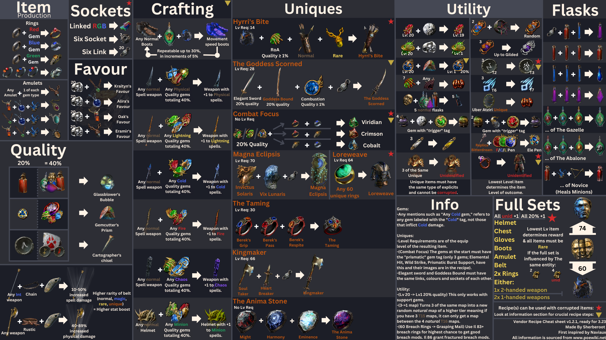

# moubai.github.io
outils pour Path of exile

## les plus utiles selon moi
voir tableau

|lien|sujet|
|--|-----|
|<https://github.com/PathOfBuildingCommunity/PathOfBuilding/releases> | Path of building community |
|<https://github.com/ChaosRecipeEnhancer/EnhancePoEApp/releases> |  Chaos recipe Enchancer - permet de faire les set de chaos recipe facilement |
|<https://github.com/SnosMe/awakened-poe-trade/releases> | Awakened poe Trade - permet de vérifier le prix d'un item facilement
|<https://github.com/C1rdec/Poe-Lurker/releases> | poe lurker - interface pour trade plus facilement
|<https://github.com/exilence-ce/exilence-ce/releases> | suivi monétaire
|<https://poe.ninja> | site pour vérifier les prix |
|<https://wealthyexile.com/> | site pour connaitre la valeur des onglets de coffre |
|<https://www.pohx.net> | le spécialiste du RF |
|<https://poe.re/#/expedition> | regex pour filtrer les items valant le coup chez Gwenen (gamble expedition) |
|<https://vilsol.github.io/timeless-jewels> | pour calculer les jewel timeless |
|<https://grinding.zone> | site regroupant d'autres sites sur poe un peu comme cette page |
|<https://www.craftofexile.com/> | site qui permet de vérifier les ilevel et craft ainsi que de simuler un craft comme en jeu |
|<https://blight.raelys.com/> | permet de voir les couleurs d'huiles pour annoindre les items |
|<https://bulk.tftrove.com/> | pour vendre en bulk sur le discord TFT |
|<https://docs.google.com/spreadsheets/d/18WQBtmmPk7XfFnOnBb0rGN2Y7D5GFOTzD81YfdZr1vo/edit?usp=sharing> | copie du google sheet de Path of math, bcp d'infos crafting de base avec fossiles |
|<https://heartofphos.github.io/exile-leveling/#/build> | aide pour leveler à partir d'un build pob |

## atlas start league
Start League atlas. n'est plus à jour (version 3.24)   
[spé Legion](https://poeplanner.com/atlas-tree/BAAKAGQAXz4PgWXyArYe12IDePjlMWzzCEOLLhGEXaCEKmSA_sXxVLj_p-LzW_16MPoo53hmlIOl2hCAXp3OWsn9-nR9Wo3qk_KovPz6KrvZW30erzq3XX2RBmoOSt7-nzumNAf01ysqEntgKl6HnS370MbsDwLFKY2OOYomfiuCUYjo3YPwgLPH4RBOG6LQ4Axb1l9KyxfPiRfdkc7EH67vE30Yi_21C3HBdP1t1WI4xgMwZoczxncU2JvVaalD-uVmHz8ITPIc3elnJuYUAB-LCAAAAAAAAAMDAAAAAAAAAAAA)

[spé heist+blight+delirium](https://poeplanner.com/a/-Tv) 3.25

## vendore recipe cheatsheet

## Heist
[Guide video sur la heist](https://www.youtube.com/watch?v=diMCoubOBd4).  
[infos jobs](https://poedb.tw/us/Heist_league#Jobs)

  ### pnj a faire dans l'ordre suivant
  <https://poedb.tw/us/Heist_league#NPCsIntro>

  ### regex recherche
  "engi duplicate" (cibler les coffres à maps)
  
  ### items pnj
  Arme: arrow lvl5 (ou 3 pour huck) avec Grant level 15 haste skill.  
  cape: x% chance on opening chest to not generate alert level ou x% reduced raison of alert level from opening chest.  
  amulette: "duplicate contained basic currency" + job speed, pour le farme de rogue marker avoir x% increased rogue's marker value of primary heist target en plus.  
  perk : +1 to level job afin de pouvoir farmer plus de faveurs de giana (spam alté avec le mot "all jobs").  

  Trinket: best in slot = chaos orb to divine orb

## tips divers
### poe lurker
#### [Incoming Trades](https://docs.google.com/presentation/d/1XhaSSNAFGxzouc5amzAW8c_6ifToNjnsQq5UmNgLXoo/present?slide=id.g6e2508016e_0_0):
- `First Click`: invite buyer to your party.
- `Long mouse down (500ms)`: invite buyer to your party.
- `Second Click`: send trade request.
- `Left/Blue corner`: "Busy" message.
- `Right/Red corner`: dismiss Buyer's offer.
- `Right-Click`: /Whois Buyer.
- `Alt-Click`: set active offer (if you have multiple incoming trades).
- `Ctrl-Click`: "Already Sold" message.
- `Ctrl-Shift-Click`: "Still Interested?" message.
- `Click Health Globe`: highlight item in stash (must manually click relevant stash tab).

## builds potentiels

a little piracy link

# WIKITIPIAK

# Welcome back !

---

# Torrent | DDL | Streaming | etc.

---

# 🏴‍☠️ Tipiakeries

#1 Streaming

### Applications de streaming
- [Stremio](https://www.stremio.com/downloads) - Regardez des films, des séries et d'autres contenus via des [extensions](https://stremio-addons.netlify.app/). Rendez-vous dans [ce tuto](https://www.reddit.com/r/FrancePirate/comments/1d3b561/streaming_films_et_s%C3%A9ries_en_vf_stremio/) pour une configuration étape par étape et sur [r/Stremio_France](https://www.reddit.com/r/Stremio_France/) ou [r/Stremio](https://www.reddit.com/r/Stremio/) pour plus d'infos.

### Films / Séries
- [Recherche Stream](https://recherche-stream.fr/) | 🇫🇷 - [Pub](https://francepirate.gitbook.io/wikitipiak/avant-de-commencer#id-1.-bloqueur-de-publicite) / Moteur de recherche pour trouver une vidéo à visionner.
- [Movix](https://movix.website/) | 🇫🇷 - [Pub](https://francepirate.gitbook.io/wikitipiak/avant-de-commencer#id-1.-bloqueur-de-publicite) / Films / Séries / Animés / 1080p / [Lien](https://movix.website/) pour avoir à jour le nom de domaine
- [Cinepulse](https://cinepulse.to/) | 🇫🇷 - [Petite pub skipable](https://francepirate.gitbook.io/wikitipiak/avant-de-commencer#id-1.-bloqueur-de-publicite) / Films / Séries / Animés / 1080p / [Discord](https://discord.com/invite/qtGRVkEjjz) pour avoir à jour le nom de domaine
- [XalaFlix](https://xalaflix.io/) | 🇫🇷 - [Pub](https://francepirate.gitbook.io/wikitipiak/avant-de-commencer#id-1.-bloqueur-de-publicite) / Seulement pour les films.
- [Cinstream](https://cinestream.info/) | 🇫🇷 - [Pub](https://francepirate.gitbook.io/wikitipiak/avant-de-commencer#id-1.-bloqueur-de-publicite) / Seulement pour les films
- [WiFlix](https://flemmix.sbs/) | 🇫🇷 - Films / Séries / Animés / 1080p / [Telegram](https://t.me/wiflix2023) pour avoir à jour le nom de domaine
- [Badfov](https://badfov.com/) / [Yakriv](https://yakriv.com/) | 🇫🇷 - Aucune pub (change régulièrement de nom de domaine. Si lien HS, google : "Badfov devient")
- [Zone-Telechargement](https://www.zone-telechargement.diy/) | 🇫🇷 - Films / Séries / Animés / 1080p / [Telegram](https://t.me/ZT_officiel)
- [Nunflix](https://nunflix.org/), [2](https://nunflix.live/), [3](https://nunflix-firebase.firebaseapp.com/), [4](https://nunflix-firebase.web.app/), [5](https://nunflix-ey9.pages.dev/) | 🇬🇧 ST 🇫🇷 - Films / Séries / Animés / 1080p / [Discord](https://discord.gg/CXVyfhgn26)

### Sport
#### Live
- [Ohquelbut](https://quelbut.mom/) | 🇫🇷 - C'est français, c'est quali / Direct / [Status](https://ohquelbut.chatango.com/)
- [Stream2Watch](https://yes.stream2watch.com/) | 🇬🇧 - Sports en direct / TV / Multi-sports / HD / [Telegram](https://t.me/istream2watch)
- [StreamTonFoot](https://streamtonfoot.vercel.app/) | Football en direct
- [Streamed](https://streamed.su/) | 🇬🇧 – Sports en direct / Multi-sports / HD / [Discord](https://discord.com/invite/KHC4xTYZgv)
- [SportPlus.live](https://en12.sportplus.live/) | 🇬🇧 – Football / Tennis / Basketball / Multi-sports / HD
- [Soccer Streams](https://socceronline.me/) / [NBABox](https://www.nbabox.me/) et d'autres [liens du même hébergeur](https://rentry.org/894dq2c9)
- [TotalSportek](https://totalsportek.pro/), [2](https://www.totalsportek.to/)

#### Replay
- [FullReplays](https://www.fullreplays.com/) | 🇬🇧 - Replay de matchs de football
- [Basketball Video](https://basketball-video.com/) - Basketball Replays / 1080p
- [Watch-Wrestling.eu](https://watch-wrestling.eu/) - MMA / Wrestling Replays / 1080p
- [Nascar Classics](https://classics.nascar.com/) - Nascar Replays / 1080p
- [FullRaces](https://fullraces.com/) - Sports mécaniques Replays / 1080p

### Anime & Manga
- [Fankai](https://fankai.fr/productions) | 🇫🇷 - C'est français, c'est quali ! (Streaming KO actuellement) / [Discord](https://discord.gg/team-fankai-414117314418704414)
- [FrAnime](https://franime.fr/) | 🇫🇷 - C'est français, c'est quali !
- [Cartoonhub](https://www.catoonhub.com/) | 🇫🇷 - C'est français, c'est quali ! / [Discord](https://discord.com/invite/M7gRTuXc6d)
- [Animeo](https://animeovf.fr/) | 🇫🇷 - Aucune pub. Connexion discord requise. Très bon site pour Cast facilement sur TV
- [AnimeUltra](https://v8.animesultra.net/) | 🇫🇷 - C'est français, c'est quali !
- [ToonAnime](https://www.toonanime.biz/) | 🇫🇷 - C'est français, c'est quali !
- [AnimeKO](https://w2.animeko.ws/) | 🇫🇷 - C'est français, c'est quali !
- [HiAnime](https://hianime.to/) | 🇬🇧 ST 🇫🇷 - 1080p / [Discord](https://discord.gg/hianime) / [Apk](https://hianime.to/app-download)
- [VoirAnime](https://v5.voiranime.com/) | 🇫🇷 - 1080p
- [French-Anime](https://french-anime.com/) | 🇫🇷 - 1080p
- [JetAnimes](https://wxw.jetanimes.com/) | 🇬🇧 ST 🇫🇷 - 1080p
- [AllManga](https://allmanga.to/) | 🇬🇧 ST 🇫🇷 - 1080p
- [AnimePahe](https://animepahe.ru/) | 🇬🇧 ST 🇫🇷 - 1080p
- [GoGoAnime](https://gogoanime3.co/) | 🇬🇧 ST 🇫🇷 - 1080p
- [KickAssAnime](https://kickassanime.mx/) | 🇬🇧 ST 🇫🇷 - 1080p / [Discord](https://discord.gg/qduzrvTG6p)
- [Yugenanime](https://yugenanime.tv/) | 🇬🇧 ST 🇫🇷 - 1080p

### Cartoons
- [Kimcartoon.si](https://kimcartoon.si/) | 🇬🇧 ST 🇫🇷 - 720p

### TV
- [Buffstream](https://the.buffstream.io/tv-streams-live-1) | 🇫🇷 & 🇬🇧 - Plusieurs centaines de chaînes en **direct** de **très bonne qualité**.

---

## Torrenting

### Films / Séries
- [Yggtorrent](https://yggtorrent.qa/) | 🇫🇷 - interface simple et intuitive, large choix de contenus
- [Sharewood](https://www.sharewood.tv/) | 🇫🇷 - communauté active, focus sur les séries et films
- [Demonoid](https://www.demonoid.is/) | 🇬🇧 - inscription nécessaire, torrents vérifiés
- [1337x](https://1337x.to/) | 🇬🇧 - interface moderne, moteur de recherche performant
- [TorrentGalaxy](https://torrentgalaxy.to/) | 🇬🇧 - annuaire de torrents, accès à plusieurs sites
- [Ext.to](https://ext.to/) | 🇬🇧 - similaire à TorrentGalaxy, interface plus simple
- [TorrentDownloads](https://www.torrentdownloads.pro/) | 🇬🇧 - grand nombre de torrents

---

## DDL

### Films / Séries
- [Zone-Téléchargement](https://www.zone-telechargement.diy/) | 🇫🇷 - Le site change régulièrement de nom de domaine, vous pouvez suivre les màj dans leur [canal télégram](https://t.me/ZT_officiel)
- [Wawacity](https://www.wawacity.diy/) | 🇫🇷 - Le site change régulièrement de nom de domaine, vous pouvez suivre les màj dans leur canal télégram
- [Darkiworld](https://darkiworld2025.com/) | 🇫🇷 - Gros catalogue, DDL & Stream

### ROMs
- [MyRient Universal Shop](https://myrient.erista.me/) - Plus grosse base de données pour roms en tout genre
- [3ds Shop](https://hshop.erista.me/) - roms pour consoles Nintendo 3DS
- [NoPayStation](https://nopaystation.com/) - roms pour consoles Playstation
- [Universal Shop](https://r-roms.github.io/) - roms pour de nombreuses consoles

### Livres
- [Bookys](https://www6.bookys-ebooks.com/) - Du ebook, du ebook et du ebook
- [Annas Archive](https://annas-archive.org/) - Plus grosse base de données pour Livre en tout genre
- [Z-Library](https://fr.1lib.sk/) - bibliothèque numérique complète / [Reddit](https://www.reddit.com/r/zlibrary/)
- [Liber3](https://liber3.eth.limo/) - livres et ebooks libres de droits
- [Zonne-ebook](https://zone-ebook.com/) - Livres, bandes dessinées, magazines, journaux et livres audio
- [PDF-prof](https://pdfprof.com/) - Livres éducatifs
- [MagazineLib](https://magazinelib.com/) - magazines et revues en format PDF
- [Origines](https://mangas-origines.fr/) - mangas et comics en tout genre
- [Sushiscan](https://sushiscan.net/) - mangas et comics en tout genre
- [Planete-BD](https://planete-bd.org/) - principalement des BD et Comics
- [Lelscanfr](https://lelscanfr.com/) - mangas principalement
- [Fr-Scan](https://fr-scan.com/) - mangas et bandes dessinées numérisés

### Telegram de BD / Comics / Mangas / Presse
#### Canaux Telegram 🇫🇷 avec pdf, cbr et epubs :
- Livres : [Bibliotheque_EpubFR](https://t.me/Bibliotheque_EpubFR)
- Bandes dessinées : [bd_fr](https://t.me/bd_fr)
- Bandes dessinées Fr-Be : [BD_FrBe](https://t.me/BD_FrBe)
- Mangas : [BD_Mangas](https://t.me/BD_Mangas)
- Comics : [BD_Comics](https://t.me/BD_Comics)

#### Canaux VK
- [Au Phil Des Bulles](https://vk.com/aufildesbulles) - Livres / BD / Comics / Mangas

### Articles Académiques
- [Sci-Hub](https://sci-hub.se/) - Accès à des millions d'articles scientifiques
- [Libgen](https://libgen.rs/) - Livres et manuels scolaires en libre accès
- [Annas Archive](https://annas-archive.org/) - Plus grosse base de données pour Livre mais possède aussi des articles académiques
- [Theses](https://www.theses.fr/) - moteur de recherche des thèses françaises

---

## **Bureautique et Productivité**

### Bureautique
- [Microsoft Activation Scripts](https://github.com/massgravel/Microsoft-Activation-Scripts) | 🇬🇧 – Scripts open source pour activer Windows / Office en ligne de commande

---

## Musique

### Ressources
- [Music Megathread](https://github.com/MoonWalker440/Music-Megathread/)

### Bureau, Web et Applications
- [squid](https://squid.wtf/) - Deezer FLAC downloader
- [Zotify](https://zotify.xyz/zotify/zotify) - Spotify
- [doubledouble.top](https://doubledouble.top/) - Multi HI-RES
- [yet another music server](https://yetanothermusicserver.top/invite/AaWeY6kV) - Deezer / Tidal / Qobuz / Spotify / YouTube / FLAC
- [SpotifyDown](https://spotifydown.com/) - Spotify / 320kbps MP3
- [Lucida](https://lucida.to/) - Téléchargement de musique hébergée sur Spotify, Qobuz, Tidal et Soundcloud par recherche ou lien
- [Tidal-DL](https://github.com/yaronzz/Tidal-Media-Downloader) - Tidal
- [Deemix](https://archive.org/details/deemix) - Deezer
- [D-Fi](https://notabug.org/sayem314/d-fi) - Deezer
- [SCDL](https://github.com/flyingrub/scdl) - Soundcloud
- [Qobuz-DL](https://github.com/vitiko98/qobuz-dl) - Qobuz
- [Orpheus-DL](https://github.com/yarrm80s/orpheusdl) - Multi
- [Stacher.io](https://stacher.io/) - YouTube-DLP GUI
- [Soulseek](http://www.slsknet.org/news/) - P2P
- [SpotX](https://github.com/amd64fox/SpotX) - Bloqueur de pubs pour l'application Spotify sur Windows. Débloque le saut de pistes. [Mac OS](https://github.com/SpotX-CLI/SpotX-Mac), [Linux](https://github.com/SpotX-CLI/SpotX-Linux).
- [Spicetify](https://spicetify.app/) - Patch pour Spotify desktop. Ajouts de plugins pour bloquer les pubs, ajouts de fonctionnalités et nouveaux thèmes
- [myfreemp3](https://myfreemp3.tools/) - DL de mp3

### Android
- [Echo](https://github.com/brahmkshatriya/echo) - lecteur de musique qui centralise les playlists de Spotify, Deezer et YouTube Music avec une interface intuitive / [Discord](https://discord.gg/jRshx6b7FB) / [Telegram](https://t.me/echo_app)
- [xManager](https://www.xmanagerapp.com/) - permet de débloquer les fonctionnalités premium de Spotify gratuitement.
- [RVX Music et Magisk Module](https://github.com/krvstek/rvx-apks/releases) - Débloque Youtube Music Premium (Root optionnel) - Peut remplacer le YT Music original par un modifié (Root obligatoire)

---

## **Mobile**

### Android
#### Outils
- [Obtainium](https://github.com/ImranR98/Obtainium) - Sert à faire les mises à jour des applications uniquement disponibles sur GitHub | [Tuto](https://www.reddit.com/r/FrancePirate/comments/1bqir0a/youtube_revanced_ex_vanced_youtube_music_xmanager/)

#### Divers
- [Echo](https://github.com/brahmkshatriya/echo) - lecteur de musique qui centralise les playlists de Spotify, Deezer et YouTube Music avec une interface intuitive / [Discord](https://discord.gg/jRshx6b7FB) / [Telegram](https://t.me/echo_app)
- [xManager](https://www.xmanagerapp.com/) - permet de débloquer les fonctionnalités premium de Spotify.
- [YouTube ReVanced](https://github.com/driftywinds/YT-builds) - Debloque youtube premium
  - [Github](https://github.com/driftywinds/YT-builds)
  - [r/revancedapp](https://www.reddit.com/r/revancedapp)
  - [r/revancedapks](https://www.reddit.com/r/revancedapks)
  - [Telegram officiel](https://t.me/ReVanced_MMT) avec sortie des releases
- [Youtuve RVX et Magisk Module](https://github.com/krvstek/rvx-apks/releases) - Débloque YouTube Premium (Root optionnel) - Remplace l'app d'origine (Root requis)
- [NewPipe](https://newpipe.net/) - Open source, permet de lire et télécharger des vidéos YouTube sans pub.
- [Tubular](https://android.izzysoft.de/repo/apk/org.polymorphicshade.tubular) - Fork de NewPipe avec le mode PiP, le support Chromecast et SponsorBlock intégré.

#### Mod' stores
**La sécurité avant tout. Ne jamais oublier de scanner les apks dl via les internets sur [VirusTotal](https://www.virustotal.com/gui/home/upload)**
- [Liteapks](https://liteapks.com/) - Web store d'app' modées. Avantage : La team envoie des pop-ups avec lien au lancement des applications si màj à faire.
- [Liteapks App Store](https://liteapks.com/app.html) - App store
- [a2zapk](https://a2zapk.io/) - Moteur de recherche d'apk. Avantage : Lien VirusTotal dispo pour chaque application.
- [Mobilism](https://forum.mobilism.org/index.php) - Pour les jeux Android modifiés, nécessite une inscription.
- [ModYolo](https://modyolo.com/) - Index d'apk modifié

### iOS
- [YTLitePlus](https://github.com/YTLitePlus/YTLitePlus) - Version mod premium de YouTube
- [Sidestore](https://sidestore.io/) - Store alternatif

---

## YouTube

### Addons
- [Improve YouTube!](https://github.com/code-charity/youtube) optimise l’expérience YouTube avec des contrôles avancés, des automatisations et des raccourcis personnalisables. [Firefox](https://addons.mozilla.org/fr/firefox/addon/youtube-addon/) / [Chrome](https://chromewebstore.google.com/detail/improve-youtube-%F0%9F%8E%A7-for-yo/bnomihfieiccainjcjblhegjgglakjdd?pli=1)
- [SponsorBlock](https://sponsor.ajay.app/) - Sauter automatiquement les sponsos des youtubeurs / [Firefox](https://addons.mozilla.org/addon/sponsorblock) / [Chrome](https://chrome.google.com/webstore/detail/mnjggcdmjocbbbhaepdhchncahnbgone) / [Chromecast](https://github.com/gabe565/CastSponsorSkip) / [Script](https://github.com/mchangrh/sb.js), [2](https://greasyfork.org/en/scripts/453320)

### Applications
- [YT-DLP](https://github.com/yt-dlp/yt-dlp) ou [YTDL-PATCHED](https://github.com/ytdl-patched/ytdl-patched) - YouTube Downloader / [Discord](https://discord.gg/H5MNcFW63r) / [Commandes](https://github.com/TheFrenchGhosty/TheFrenchGhostys-Ultimate-YouTube-DL-Scripts-Collection)
- [Stacher](https://stacher.io/) - YT-DL GUI
- [Y232](https://y232.live/) - YT-DL WebUI

### Android
- [Youtuve RVX et Magisk Module](https://github.com/krvstek/rvx-apks/releases) - Débloque YouTube Premium (Root optionnel) - Remplace l'app d'origine (Root requis)
- [NewPipe](https://newpipe.net/) - Open source, permet de lire et télécharger des vidéos YouTube sans pub.
- [Tubular](https://android.izzysoft.de/repo/apk/org.polymorphicshade.tubular) - Fork de NewPipe avec le mode PiP, le support Chromecast et SponsorBlock intégré.
- [YouTube RV](https://github.com/driftywinds/YT-builds) - Debloque youtube premium / [Git](https://github.com/driftywinds/YT-builds) / [r/revancedapp](https://www.reddit.com/r/revancedapp) / [r/revancedapks](https://www.reddit.com/r/revancedapks) / [Telegram](https://t.me/ReVanced_MMT)

### iOS
- [YTLitePlus](https://github.com/YTLitePlus/YTLitePlus) - Version mod premium de YouTube

---

## Gaming

### Jeux PC anciens/rétro
- [Archive ClassidPCGames](https://archive.org/details/classicpcgames) - Archive de vieux jeux PC
- [MyAbandoneware](https://www.myabandonware.com/) - Jeux laissés à l'abandon par leurs créateurs
- [OldGamesDownload](https://oldgamesdownload.com/) - Archive de vieux jeux PC et Consoles

### Jeux PC modernes
- [Gomorgames](https://www.gomorgames.com/) | 🇫🇷 - C'est français, c'est quali / [Discord](https://discord.gg/raWtANAZqF)
- [Gog Games](https://www.gog-games.to/) - Archives des jeux Gog. DRM free.
- [Gload](https://gload.cc/) - Archives de jeux.
- [CS.RIN.RU - Steam Underground Community](https://cs.rin.ru/forum/) - Site utile, surtout si vous ne trouvez pas de crack sur d'autres sites - Nécessite une inscription
- [CS.RIN.RU - GOG Games Complete Collection](https://cs.rin.ru/forum/viewtopic.php?f=38&t=136823) - collection de jeux GOG pour PC.
- [G4U](https://g4u.to/) - Archive de jeux vidéo
- [Online fix me](https://online-fix.me/) - Fourni des correctifs / bypass en ligne, vous permettant de jouer en multijoueur.
- [SteamRIP](https://steamrip.com/) - Archives de bibliothèque steam

### Repacks
Les repacks sont des jeux compressés. Ils peuvent prendre beaucoup de temps à l'installation en raison de la décompression des fichiers.
- [ARMGDDNG](https://t.me/ARMGDDNGames) - Groupe de repackeur qui agit sur telegram
- [FitGirl](https://fitgirl-repacks.site/) - Certainement les plus connus en date
- [ElAmigo](https://elamigos.site/) - Autre grand groupe de repack connu
- [Gnarly](https://rentry.org/gnarly_repacks)
- [KaosKrew](https://kaoskrew.org/)

### Emulation
- [r/Roms Megathread](https://r-roms.github.io/)
- [CDRomance](https://cdromance.com/)
- [Edge Emulation](https://edgeemu.net/)
- [Myrient](https://myrient.erista.me/)
- [NxBrew](https://nxbrew.com/) - ROM pour Nintendo switch
- [Ziperto](https://www.ziperto.com/)

---

## Stuff divers
- Canva - Liens d'invitation vers des groupes de travail sur Canva, ouvrant toutes les fonctionnalités premium : [ProInviteLinks](https://www.proinvitelinks.com/?m=1) - [Télégram 01](https://t.me/Canva_pro_team_links) - [Telegram 02](https://t.me/+vr2mIq-bj3NmYmU9)

🫵🖕

